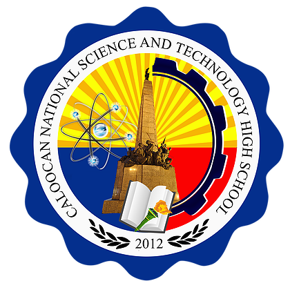

<!--  -->

# CalNatSci-Discord-Bot
This is an unofficial Discord bot for CalNatSci.

## About
I got bored so i decided to create this discord bot. I decided to create a bot with actually useful commands that can be used by other students.

**Dependencies:**
* `Discord.js`    - Discord API wrapper
* `GoogleApis`    - For Google Classroom API
* `Node-Fetch`    - For RESTful APIs
* `Cryptr`        - Encryption of some files
* `Moment`        - Because JS Dates are awful
* `Moment-Timezone` - Conversion of Dates via Timezone

**Dev-Dependencies:**
* `Dotenv`        - Set Environment Variables

Not Officially Affiliated with **Caloocan National Science and Technology Highschool (CNSTHS)**

 

## Commands
|Commands           |Description
|-------------------|-----------
|help               | Sends help command
|fact               | Sends a random fact using `uselessfacts.jsph.pl` API

